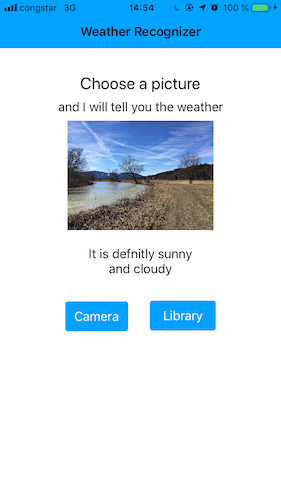

# Weather-Recognizer-App

An application that detects the weather of photos by using machine learning with Core ML

The App classifies the following weather types

- Rainy
- Sunny
- Cloudy
- Snowy

It can pic up images from the `camera` or `photo roll`

